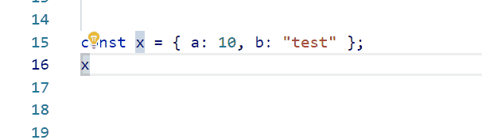

# Hediet TypeScript Refactorings

This is a VS Code Extension for refactorings that I had time and fun to program.
Feel free to use them too.

## Supported Refactorings

-   Convert string concatenation to string template

## Supported Actions

-   Faster Smart Select. Selects the next top node that is child of an array
-   Convert expression statement to destructuring statement

